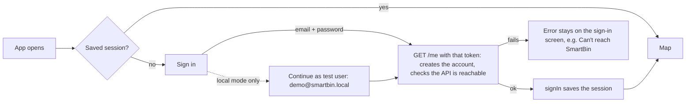
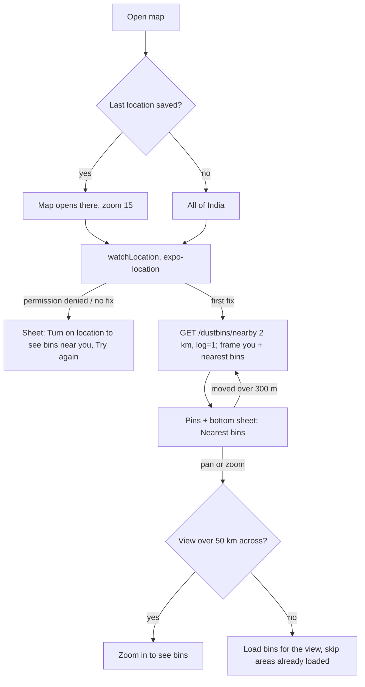
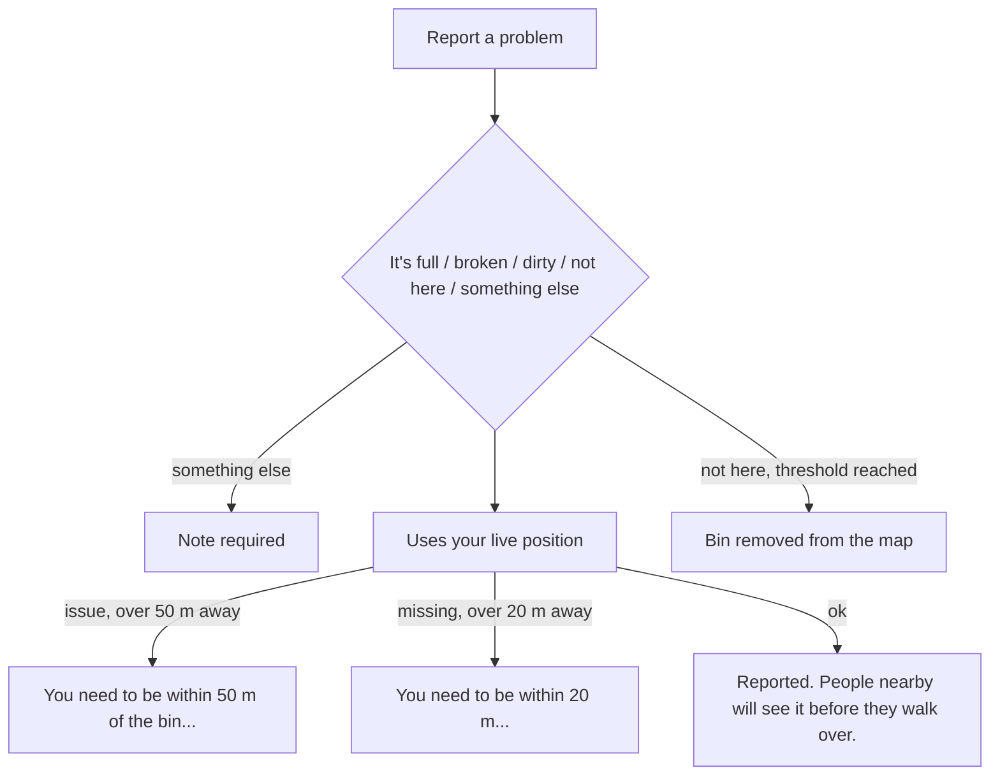
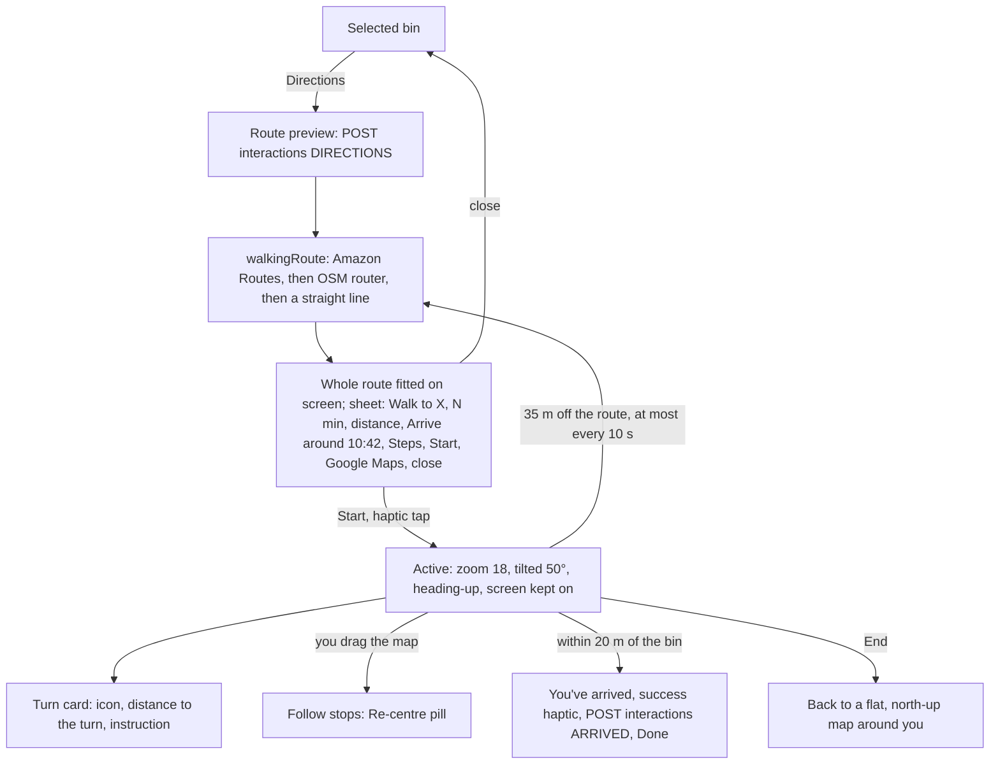
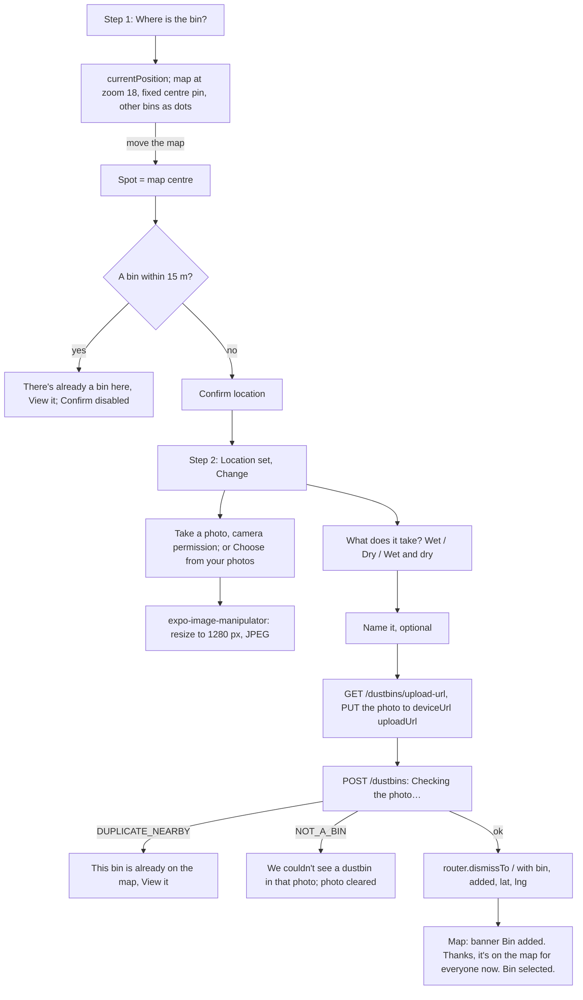

# SmartBin mobile: screens and flows

The same journeys as the web app's user side (`apps/web/FLOWS.md` in the `Smartbin` repo), built for phones. The main difference is that directions get a **route preview with Start**, then Google-Maps-style turn-by-turn navigation. Admins use the web dashboard; there's no admin UI here. The API behind every step is described in `docs/api.md` in the `Smartbin` repo.

## Screens (Expo Router, `src/app/`)

| Route | File | Screen |
|---|---|---|
| `/sign-in` | `sign-in.tsx` | Sign in / create account |
| `/` | `index.tsx` | Map: nearby bins, bin sheet, directions and navigation |
| `/add` | `add.tsx` | Add a bin (2 steps) |
| `/account` | `account.tsx` | Account |

`_layout.tsx` builds one `Stack` with no headers and two `Stack.Protected` groups. When signed in you get `index`, `add` and `account`; when signed out you get `sign-in`. **Changing the session is the navigation:** `signIn()` and `signOut()` update `useSession()`, and the router switches groups by itself, so screens never `router.replace` after signing in or out. The splash screen stays up until fonts and the saved session have loaded.

## Sign in

- The API is checked **before** the session is saved. Saving first would flash the map, sign out again and lose the error.
- Sign in / Create account toggles the copy ("Welcome back" / "Create your account"). Sign-up needs a password of at least 8 characters.
- The token lives in `expo-secure-store` (`localStorage` on web) under `smartbin.session`.
- **Local mode** (`EXPO_PUBLIC_AUTH_MODE=dev`): the token is the email and any password works. With Cognito, the test button disappears and `lib/auth.ts` is replaced (see `.claude/rules/aws-handoff.md`).

## Find a bin (`/`)

- Filter chips: **All / Wet / Dry**. "Wet" also includes bins that take both.
- Tapping a pin or a list row selects the bin (`POST /interactions VIEW`). The camera eases it above the sheet and the sheet opens. Tapping empty map clears the selection.
- **Sheet:** shows up to 46% of the screen. Swipe the handle down, or tap it, to collapse it to one line; swipe up or tap to open it.
- **Locate button (◎):** recentres on you and reloads nearby bins.

### Selected bin and problems

Shows the photo, name, wet/dry badges, missing-report count, open problems with **Emptied / Fixed / Cleaned / Sorted**, distance and walking minutes, plus **Directions** and **Report a problem**.

The rules are the same as on the web: problems close when someone marks them sorted (also within 50 m), and "full" closes on its own after `fullIssueHours`. Missing reports count against the monthly quota.

## Directions and navigation

- **Heading** comes from the compass first (`watchCompass`, ignoring wobbles under 8°), then the GPS course, then the direction of the route where you are.
- Pins can't be selected while directions are open.
- If routing fails, the route is a straight line with "Walking routes are unavailable right now, so this is a straight line. Stick to paths and roads."
- **Google Maps** opens Google Maps walking directions to the bin.

## Add a bin (`/add`)

- The map screen stays mounted underneath `/add`, so it reacts to the new params in an effect, fetches the bin around `lat`/`lng`, selects it, then clears the params with `router.setParams`.
- **View it** in the duplicate warnings goes back to the map with that bin selected.

## Account (`/account`)

Shows your email and role, **This month** (bins added and missing reports left, and the reset date), **Appearance** (Light / Dark / System), **Privacy policy** (opens `${EXPO_PUBLIC_SITE_URL}/privacy` in an in-app browser) and **Sign out**, after which the guard shows sign-in.

## States every screen handles

| State | What people see |
|---|---|
| Starting | The splash screen, until fonts and the session are loaded |
| Location off | "Location is turned off for SmartBin. Allow it in your phone's settings, then try again." with **Try again** |
| API unreachable | "Can't reach SmartBin. Check your connection and try again." |
| 401 from the API | `api()` signs out, and the guard shows sign-in |
| No bins | "No bins mapped here yet. Spotted one nearby? Add it and it'll show up for everyone." |
| Map tiles fail | `switchToFallbackStyle()` moves from Amazon to OpenFreeMap for the rest of the session |
| Expo Go (no MapLibre) | The map area says it needs the development build; everything else works |
